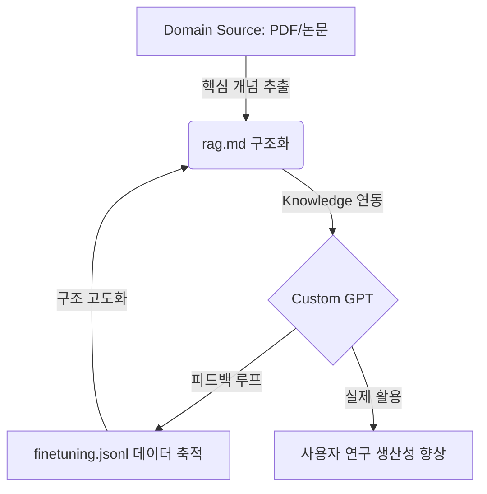

# RAG 기반 도메인 특화 LLM 시스템 설계

> **Custom GPT와 도메인 Knowledge를 결합한 차세대 지식 파트너 솔루션**

도메인별 전문 지식 파워를 극대화하기 위해 RAG(Retrieval-Augmented Generation)와 파인튜닝 데이터를 구조화하여 관리하는 핵심 레포지토리입니다.

---

## 🔗 GPT 즉시 체험하기

| Domain | Link | Status |
| :--- | :--- | :--- |
| **Information Security** | [바로가기 (Custom GPT)](https://chatgpt.com/g/g-69d9cfac3f288191be53b8f422550783-jeongbobohogonghag-gpt) | `Online` |

---

## 🚀 프로젝트 핵심 가치

- **지식 자산화**: 흩어진 문서를 체계적인 지식 구조로 변환
- **설명 품질 표준화**: 파인튜닝 패턴을 통한 일관된 전문가급 답변
- **연구 효율성**: 도메인 특화 검색 최적화로 정보 탐색 시간 80% 단축
- **관계형 이해**: 개별 개념을 넘어선 지식 그래프 기반 사고 지원

---

## 🏛️ Core Architecture

지식은 단순한 텍스트가 아니라 **살아있는 구조**가 되어야 합니다.



---

## 📁 Repository Structure

```tree
knowledge-partner/
├── 🛡️ infosec/         # 정보보호공학 도메인
│   ├── README.md       # 도메인 가이드 및 미리보기
│   ├── infosec_rag.md  # RAG 지식 구조화 문서
│   └── infosec_finetuning.jsonl
└── 📋 (Upcoming)       # 신규 도메인 확장 예정
```

---

## 🎯 Domain Strategy

각 도메인은 독립적이면서도 상호 보완적인 지식 구조를 유지합니다.

- **전문성 유지**: 도메인 고유 기술 용어와 맥락 정밀 반영
- **관계 지향**: 개념 간의 연결 고리를 명시적으로 정의 (Knowledge Graph)
- **성장형 시스템**: 대화 패턴 분석을 통한 지속적인 지재권 고도화

---

## 🗺️ Long Term Vision

- [ ] 전사적 레벨의 전문 도메인 Knowledge Partner 라인업 구축
- [ ] AI 기반의 실시간 지식 그래프 자동 생성 시스템 연동
- [ ] 연구 생산성을 획기적으로 개선하는 Personal AI Lab 완성

---

© 2026 RAG-Based Domain LLM Engineering. All rights reserved.
