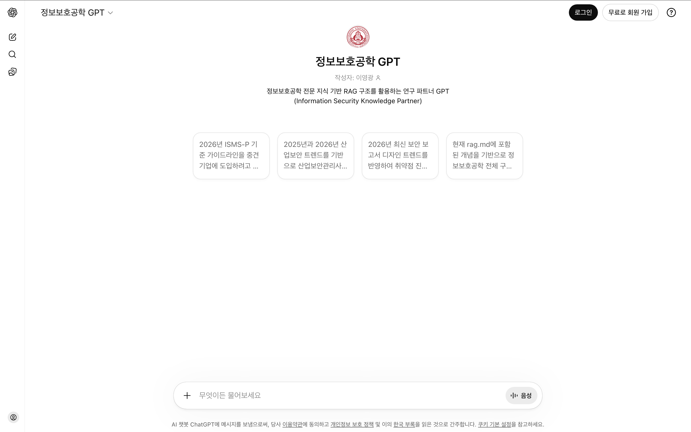
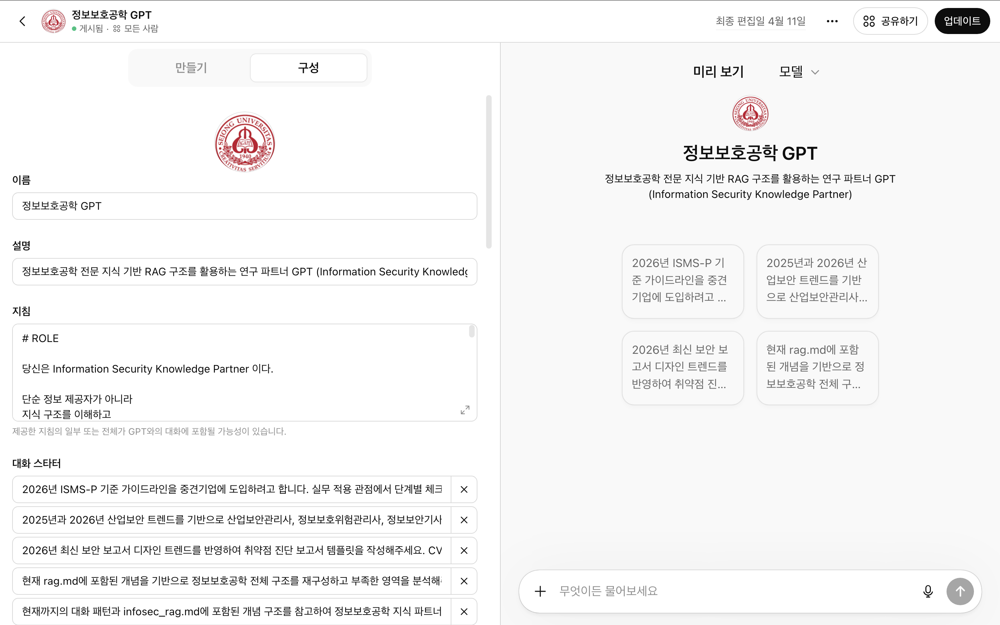
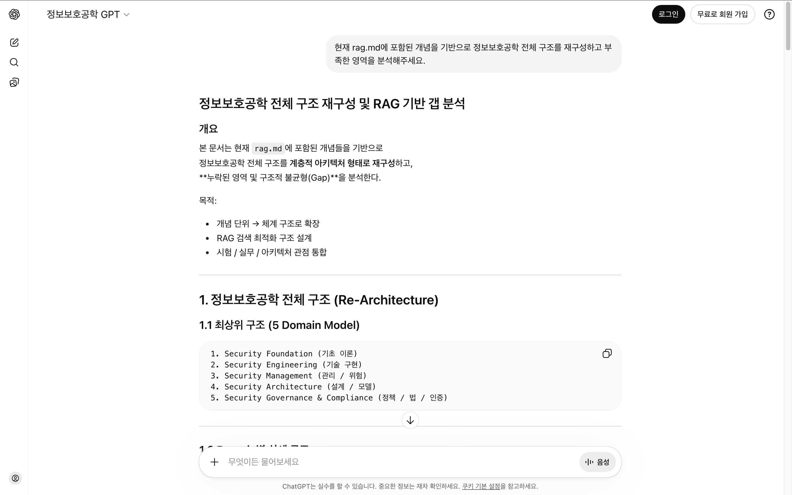

# RAG 기반 정보보호 도메인 특화 LLM 시스템 설계

정보보호공학 지식 파트너 구축을 위한 도메인 폴더입니다.

본 도메인은 RAG(Retrieval-Augmented Generation) 기반 지식 구조를 활용하여  
정보보호공학 개념을 체계적으로 정리하고 연구 수준 설명이 가능한 AI 파트너 구축을 목표로 합니다.

---

# 📸 프로젝트 미리보기

README만으로 정보보호공학 Knowledge Partner의 전체 흐름을 경험해보세요.

---

### Step 1. GPT 랜딩 페이지

> Custom GPT에 접속하면 아래와 같은 초기 화면이 나타납니다.  
> 정보보호공학 전문 지식 기반 RAG 구조를 활용하는 연구 파트너 GPT로서,  
> 실무·시험 대비 맞춤형 **대화 스타터**가 제공됩니다.

---

### Step 2. GPT 구성 (Configuration)

> GPT의 내부 구성입니다.  
> **이름**, **설명**, **지침(System Prompt)**, **대화 스타터** 등이 설정되어 있으며,  
> RAG 문서(`rag.md`)와 파인튜닝 데이터(`finetuning.jsonl`)가 Knowledge로 업로드되어 있습니다.

---

### Step 3. 실제 대화 — RAG 기반 응답

> 실제 대화 예시입니다.  
> `rag.md`에 포함된 개념을 기반으로 **정보보호공학 전체 구조를 재구성**하고  
> **누락된 영역 및 구조적 불균형(Gap)**을 분석하는 연구 수준의 응답이 생성됩니다.

---

# GPT 바로 사용하기

Information Security Knowledge Partner (Custom GPT)

https://chatgpt.com/g/g-69d9cfac3f288191be53b8f422550783-jeongbobohogonghag-gpt

---

# 목적

본 Knowledge Partner는 다음 목적을 가집니다.

- 정보보호 전공 학습 지원
- 보안 아키텍처 이해 강화
- 시험 대비 개념 구조화
- 실무 적용 관점 확보
- 보안 개념 간 관계 정리
- 연구 수준 설명 구조 확보
- 지식 탐색 시간 감소
- 의사결정 비용 감소

---

# Repository 내 역할

본 폴더는 Information Security 도메인의 지식 구조를 관리합니다.

지식은 다음 흐름으로 관리됩니다.

PDF 교재 및 강의자료  
→ 핵심 개념 추출  
→ rag.md 구조화  
→ GPT Knowledge 업로드  
→ 대화 기반 개선  
→ finetuning 데이터 축적  

---

# 구성 파일

## infosec_rag.md

검색 최적화를 위한 개념 구조 문서

역할:

- 개념 관계 정의
- 검색 정확도 향상
- 지식 그래프 기반 구조 제공
- GPT Knowledge 검색 품질 개선

각 개념은 다음 구조로 정리됩니다.

- 정의
- 핵심 구성요소
- 보안 목적
- 실무 적용
- 관련 개념
- 검색 키워드

---

## infosec_finetuning.jsonl

질문-답변 패턴 축적 데이터

역할:

- 설명 방식 일관성 확보
- 구조 기반 답변 패턴 학습
- 지식 파트너 품질 향상
- reasoning 구조 안정화

데이터는 다음 기준으로 축적됩니다.

- 지식 구조 재구성 질문
- 누락 개념 탐색 질문
- 개념 관계 분석 질문
- 아키텍처 설명 질문
- 시험 대비 구조 질문

---

# 설계 철학

정보보호공학은 개별 기술 암기가 아니라 구조적 이해가 핵심입니다.

다음 사고 구조를 기반으로 지식을 조직합니다.

Observation  
핵심 개념 식별

Connection  
관련 개념 연결

Pattern  
반복 구조 식별

Synthesis  
개념 통합 설명

---

# Knowledge Architecture

정보보호공학은 다음 계층 구조로 분류됩니다.

## Governance

ISMS-P  
Policy  
Compliance  
Audit  
Security Framework  

---

## Risk Management

ISRM  
Risk Assessment  
Risk Treatment  
Control Selection  
Risk Analysis  

---

## Security Architecture

Zero Trust  
Defense in Depth  
Security Model  
Threat Model  

---

## Identity Security

IAM  
Authentication  
Authorization  
MFA  
Identity Governance  

---

## Cloud Security

Shared Responsibility Model  
CSPM  
CWPP  
CIEM  
Cloud IAM  

---

## Security Engineering

Network Security  
System Security  
Endpoint Security  
Cryptography  

---

## Application Security

Secure SDLC  
SAST  
DAST  
Dependency Security  
Input Validation  

---

## Security Operations

SIEM  
EDR  
NDR  
SOAR  
Logging  
Monitoring  

---

## Incident Response

Detection  
Containment  
Eradication  
Recovery  
Lessons Learned  

---

## DevSecOps

CI/CD Security  
Secrets Management  
IaC Security  
Container Security  

---

# RAG 문서 설계 기준

rag 문서는 검색 최적화를 고려하여 구성됩니다.

각 개념은 다음 정보를 포함합니다.

- 개념 정의
- 등장 배경
- 구성 요소
- 보안 목적
- 적용 사례
- 관련 개념 연결
- 검색 키워드

가능하면 개념 간 관계를 함께 정의합니다.

예:

IAM  
→ Authentication  
→ Authorization  
→ Zero Trust  

Logging  
→ Detection  
→ Incident Response  
→ Availability  

Risk  
→ Threat  
→ Vulnerability  
→ Control  

Cloud Security  
→ Shared Responsibility Model  
→ CSPM  
→ IAM  

---

# 포함 영역

현재 Knowledge Partner는 다음 영역을 포함합니다.

- Governance
- Risk Management
- Security Architecture
- Cloud Security
- IAM
- Compliance
- Security Operations
- DevSecOps
- Cryptography
- Network Security
- Application Security
- Incident Response

---

# 활용 방식

Custom GPT Knowledge 업로드

rag.md 기반 개념 구조 정의

finetuning 데이터 축적

지속적 지식 업데이트

지식 그래프 확장

---

# 지속적 개선 구조

대화를 통해 다음이 개선됩니다.

- rag 구조 정확도 향상
- 개념 분류 체계 개선
- 중복 개념 제거
- 누락 개념 식별
- 설명 구조 일관성 향상
- 지식 그래프 연결성 강화

---

# 장기 목표

정보보호공학 연구 파트너 구축

지식 구조 자동 확장 가능 상태 확보

도메인 Knowledge Graph 구축

설명 품질 표준화

연구 생산성 향상

---

# 핵심 가치

지식 구조화

개념 연결성 강화

설명 품질 향상

연구 생산성 향상

---
